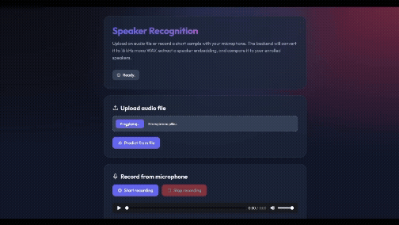

# Speaker Recognition Demo

A small end-to-end **speaker recognition system** built for an academic speech technology project.

The system identifies **who is speaking** among a small set of enrolled speakers. It uses:
- audio collected from long interview recordings
- automatic speaker diarization + manual cleanup
- a pretrained **SpeechBrain ECAPA-TDNN** embedding model
- **cosine similarity to speaker centroids** for classification
- a small **FastAPI + HTML/JS** demo application

## Project idea

The project demonstrates a practical closed-set speaker-identification pipeline:

1. collect speech for several target speakers
2. extract and normalize the audio
3. diarize long recordings into speaker segments
4. manually clean the labels and export clips
5. build train/test splits
6. extract speaker embeddings with SpeechBrain
7. classify new recordings by comparing them to enrolled speaker centroids
8. expose the model through a small backend and frontend

## Why this project exists

The project was created as a practical course assignment focused on speech technology.

## Data preparation

### Audio source
Speech was collected from **YouTube interview recordings** containing the target speakers.

### Extraction
- **yt-dlp** was used to obtain audio from the source videos
- **ffmpeg** was used to convert everything to:
  - WAV
  - 16 kHz
  - mono
  - PCM 16-bit

### Annotation
- **pyannote.audio** was used for automatic diarization
- **Audacity** was used for manual verification, cleanup, relabeling, and clip export

### Dataset structure
Clips were organized per speaker and split into:
- `train`
- `test`

Metadata was stored in:
- `clips.csv`
- `train.csv`
- `test.csv`

## Recognition approach

The current baseline uses:
- **pretrained SpeechBrain speaker embeddings**
- **centroid averaging per speaker**
- **cosine similarity** for prediction

## Result

Current baseline result on the prepared test split:
- **Accuracy: 99.55%**
- **891 / 895 correct predictions**

## Demo app

The repository also contains a small application with:
- **file upload**
- **microphone recording**
- backend inference
- predicted speaker + similarity scores

## Demo

[](https://youtu.be/zQ3wvk36CHo)

## Tech stack

- Python
- PyTorch
- SpeechBrain
- pyannote.audio
- yt-dlp
- ffmpeg
- Audacity
- FastAPI
- Uvicorn
- HTML / CSS / JavaScript

## Notes

- This repository is focused on a **small closed-set identification demo**, not a production biometric system.
- `ffmpeg` must be installed and available in `PATH`.
- The backend converts uploaded/recorded audio to 16 kHz mono WAV before prediction.
- The browser recording is not true streaming yet. It records a clip, then sends it to the backend after you press Stop.

## Possible next steps

- Logistic Regression or SVM on top of embeddings
- unknown-speaker rejection
- real-time chunk-based inference
- confidence thresholding
- more speakers and more sessions per speaker
- error analysis by clip duration and noise

## Setup

Set your Hugging Face token as an environment variable before running scripts if required:
```powershell
$env:HF_TOKEN="hf_xxx" # Replace with your actual token
```

## Files

- `predictor.py` — loads the pretrained SpeechBrain model and predicts the speaker
- `build_centroids.py` — builds speaker centroids from `train.csv`
- `backend.py` — FastAPI server with:
  - `GET /`
  - `GET /health`
  - `POST /predict`
- `static/index.html` — simple frontend with:
  - upload audio file
  - microphone recording
  - prediction results

## Expected project layout

```text
.
  app/
    backend.py
    predictor.py
    build_centroids.py
    static/
      index.html
  data/
    manifests/
      train.csv
      test.csv
    features/
  pretrained_models/
```

## Install requirements

Inside your virtual environment:

```powershell
python -m pip install -r requirements.txt
```

## Build centroids once

Run this from the project root:

```powershell
python app\build_centroids.py --repo_root .
```

This will save:

```text
data/features/centroids.pt
```

## Run the app

From the project root:

```powershell
uvicorn app.backend:app --reload
```

Then open:

```text
http://127.0.0.1:8000
```


